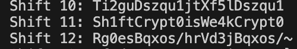

Looking at the ciphertext, I knew it could not be a substitution cipher as those were letter only.  
This left me with either XOR or Caesar cipher.  
Given that for XOR it was paramount to have at least a sliver of knowledge about the plaintext,  
therefore, it was unlikely to be a XOR cipher.  
For Caesar, I knew that ASCII could push letters such as "DEL" which was part of the ciphertext.  
With this thought, I made a small script that would shift the ciphertext through all possible lengths.

`../Scripts/challenge1.py`

This ultimately gave me more than 100 lines to sift through and legible English words.  
The flag was found on Shift 11.

