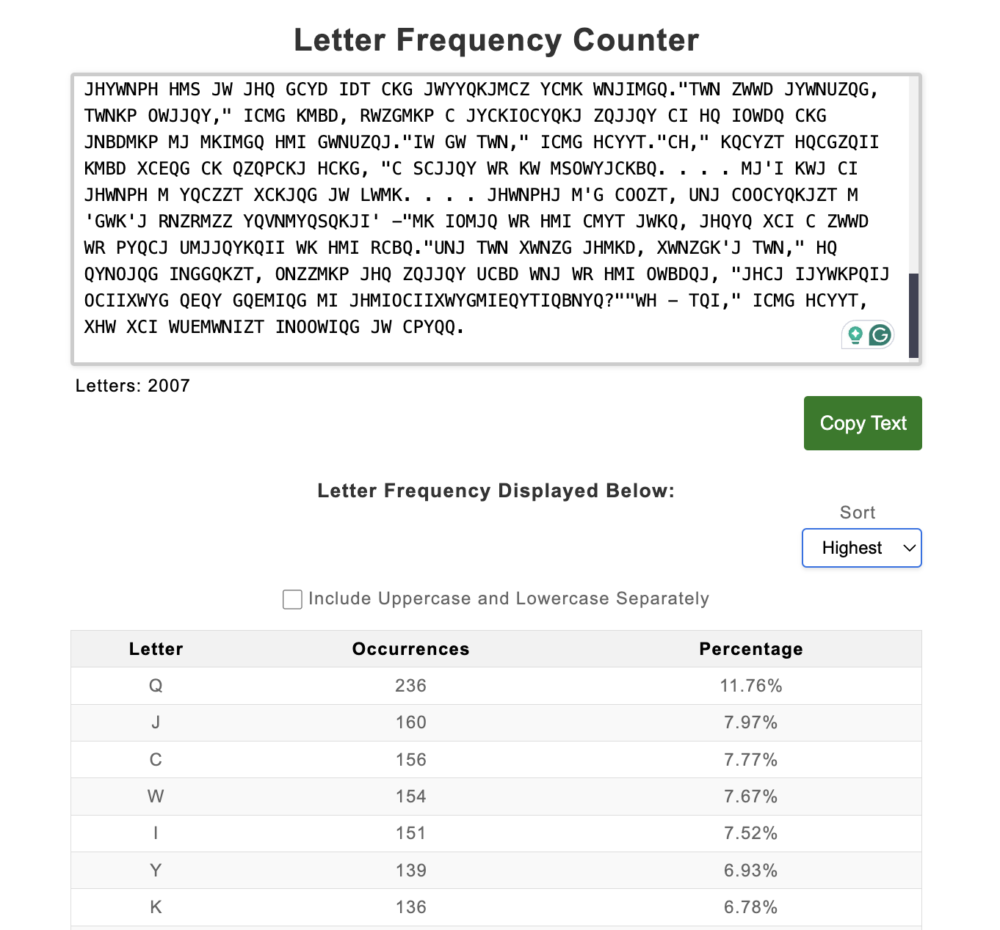
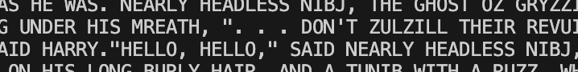
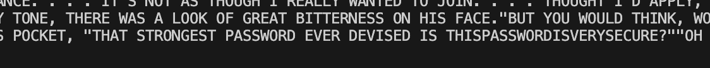

For this ciphertext, it was evident that either a Caesar or substitution cipher was used since the text contained only letters. 
Given the context of this CTF challenge and the fact that the first ciphertext used a Caesar cipher, I suspected this one might be encrypted using a substitution cipher instead.

To begin, I ran the entire ciphertext through a letter frequency analyzer. This approach gave me a solid starting point for mapping the substitution, as the most frequent letters in the ciphertext likely correspond to the most common letters in English (e.g., E, T, A, etc.).

To refine the substitution mapping, I wrote a script that allowed me to visualize the changes in the ciphertext as I adjusted the letter mappings.

`../Scripts/challenge2.py`

Gradually, I used common English language patterns to decipher the text. I uncovered a reference to "Nearly Headless Nick" from the Harry Potter series along the way.

After some Google searches and inferences, I located the flag.

