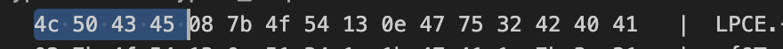
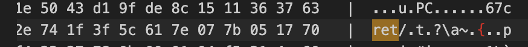
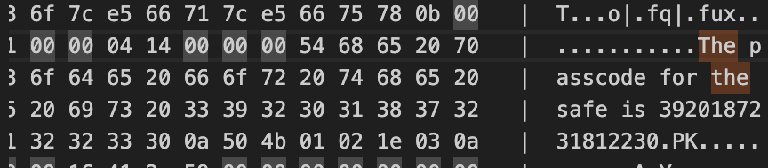

Given the length of this ciphertext, it made more sense to consider a block or stream cipher as the likely method. 
Since the CTF prompt specifically mentioned that the encrypted zip file contained information about Scrooge McDuck's safe password, I suspected that XOR encryption might be in play.

I suspected XOR because a common flaw of XOR algorithms is that, if you know some of the plaintext, you can gain a partial key. 
In this case, I leveraged the common header of a zip file to extract a portion of the XOR key. 
All inputs were converted to hex format, and outputs to ASCII for readability.

`../Scripts/challenge3.py`

By XORing the ciphertext with the known plaintext (the zip file header), I was able to recover a partial section of the XOR key.

After using this partial key to decrypt the ciphertext, I began noticing patterns in the decrypted text—specifically, what appeared to be part of the word "secret." 
Given that "cret" appeared multiple times, I inferred that it was no coincidence and expanded the key to reveal the full word "secret."

This led me to search the decrypted text for more patterns, focusing on key words from the CTF prompt, like "safe" and "Scrooge." 
Eventually, I found the words "safe" and "pass," which confirmed the correct key length. 
With this, I was able to decrypt the text fully and obtain the password.

