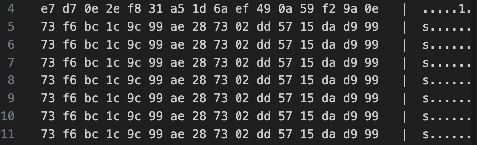

When I first encountered this encrypted image, I initially thought it might have been encrypted using XOR, as image files typically contain a header that can be easily generated. The prompt also provided a clue, mentioning a vintage Olympus 1100 camera. However, after trying various image headers, I realized XOR was not the right approach.

I then pivoted to block ciphers, specifically considering that the image could have been encrypted using an ECB (Electronic Codebook) block cipher. ECB is known for a security flaw when encrypting large amounts of data, which can leave noticeable patterns in the ciphertext.

`../Scripts/challenge4.py`

The signs of ECB encryption were evident when I converted the encrypted image into hex format, as I could clearly see repeated patterns within the ciphertext.

If the image was indeed encrypted using ECB, there was no need to fully decrypt it, since the patterns would still be visible to the human eye despite the encryption. I decided to replace the encrypted image's header with a new one that matched the size and constraints of a vintage Olympus 1100 camera.

After several attempts with different image headers, I eventually succeeded in viewing the encrypted image by using a PPM header.

(Note: The PPM image must be viewed outside the IDE and is discernible because of the visible patterns within the encrypted image.)

